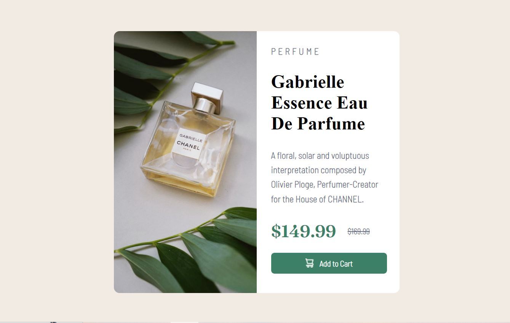

# Product Preview Gabrielle Essence Eau De Parfum

This is a simple product preview webpage for Gabrielle Essence Eau De Parfum. It was created as part of a Frontend Mentor challenge. 
You can view the live version of this page [Gabrielle Essence Eau De Parfum Demo](https://mehwishjbe.github.io/product-preview-dePerfum/).



## Table of Contents

- [About](#about)
- [Technologies Used](#technologies-used)
- [Usage](#usage)

## About

This project is a static webpage designed to showcase a perfume product. It includes details about the product, pricing information, and an "Add to Cart" button. The project was created based on the Frontend Mentor challenge "Gabrielle Essence Eau De Parfum"

## Technologies Used

- HTML5
- CSS3

## Usage

You can use this project as a starting point for creating your own Gabrielle Essence Eau De Parfum Component or as a reference for implementing similar designs. To use it, simply clone the repository to your local machine:

```bash
git clone https://github.com/mehwishjbe/product-preview-dePerfum.git
